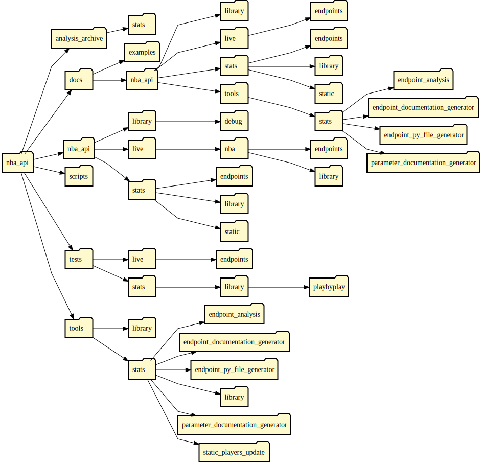

# Package Structure

# `\analysis_archive`
This directory is the archive of endpoint analysis files. 

# `\docs`
This directory contains the documentation for the package. 

# `\nba_api`
This is the directory that contains the package.

#### `\stats`
This directory contains all library for stats.nba.com API.

#### `\library`
This directory contains files that are necessary to the package. In addition, these files can be used for additional purposes such as connecting to an endpoint or valid parameter values for endpoints.

# `\scripts`
This directory contains the scripts.

# `\tests`
This directory contains the tests.

# `\tools`
This directory contains the foundational tools of this package. These tools are used to help keep the package and documentation updated.